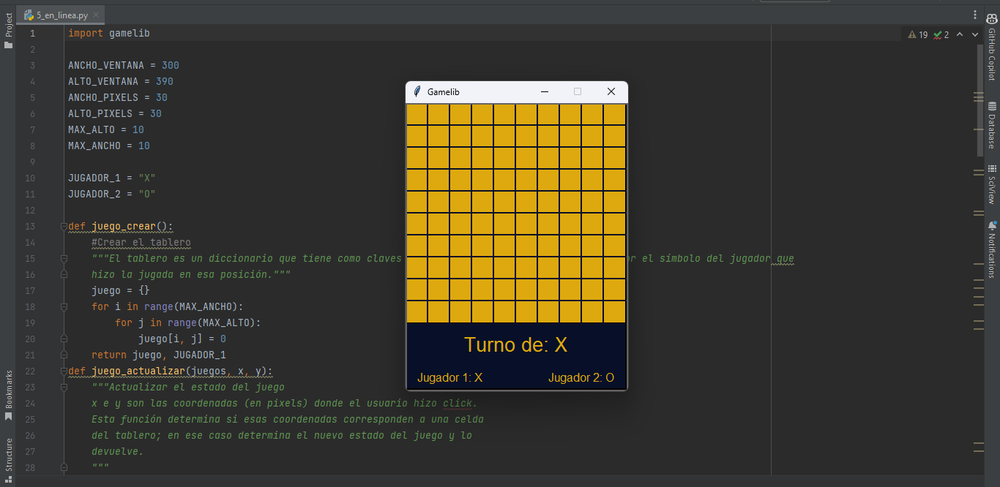
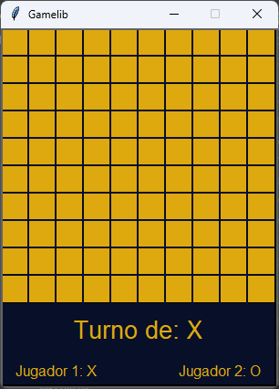
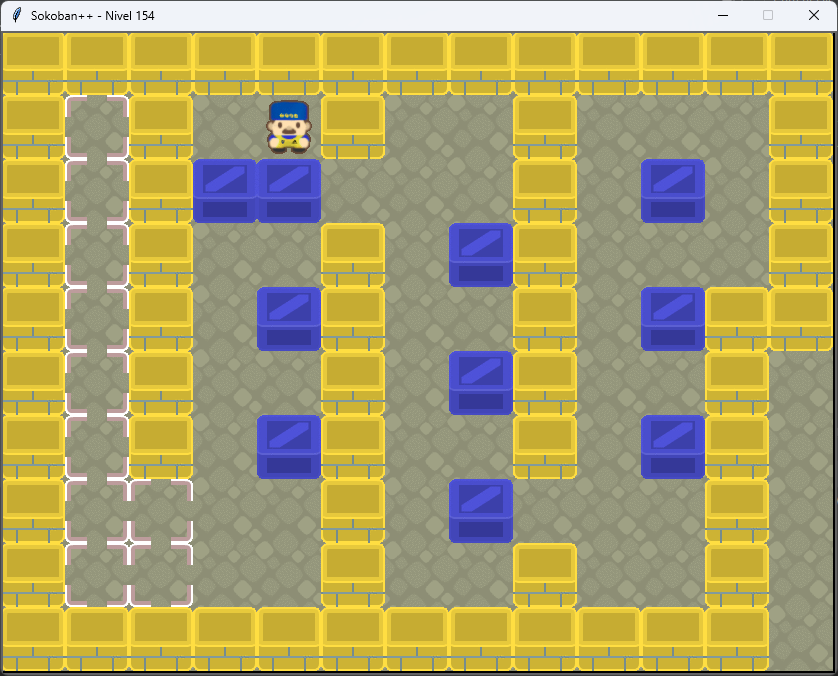
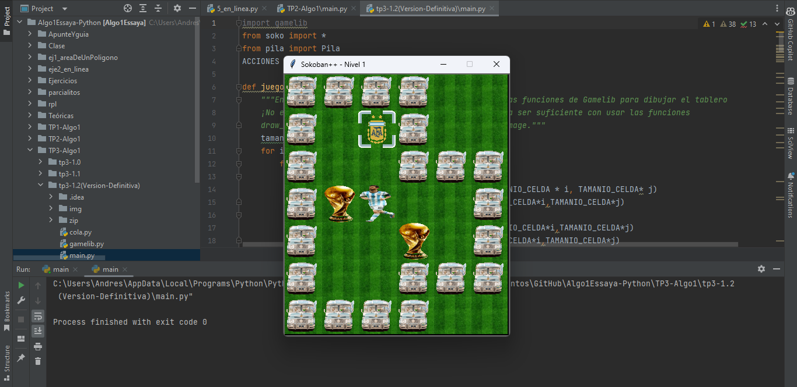
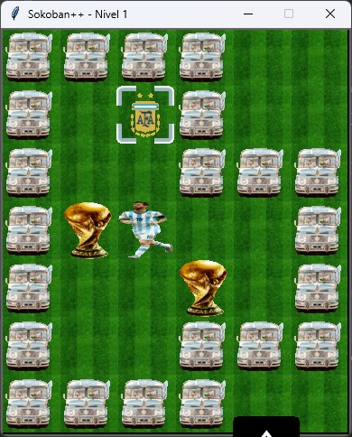

# Algoritmos y Programcion 1 FIUBA
Este es un repositorio con todo el contenido realizado en esta materia: ejercicios , rpl , Tps, parciales y finales.
### Capturas de Pantalla de Algunos Proyectos

5 En Linea:

Sokoban Tp2:

Sokoban Tp3:

